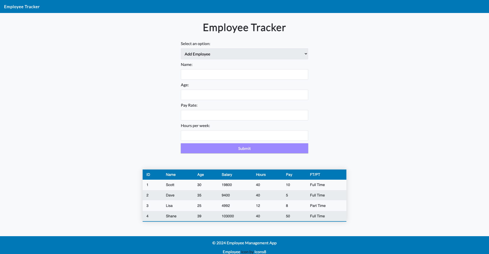

# Employee Tracker

You can find the deployed project at [Employee Tracker](https://jeremichshane-fs.github.io/employee-tracker/)

## Overview

A small employee tracker program that will utilize inheritance, modular design, and the use of data structures and more advanced array methods.

> **The Challenge**

This requires creating a JavaScript program structured within a Main class and an IIFE for instantiation. It involves implementing inheritance with three classes: Employee (superclass), PartTime, and Manager. Each class has specific properties and a calculatePay() method to determine annual salaries. The program includes a menu-driven interface with options to add, remove, edit, and display employee information. Input prompts facilitate user interaction for adding/editing employees, while console output provides clear presentation of employee data, including ID, name, salary, hours, pay, and employee type. The implementation ensures modularity, clear user feedback, and adherence to object-oriented principles.

 

 

## Contributors

|                                       [Shane Jeremich](https://github.com/shanejeremich)                                       |
| :----------------------------------------------------------------------------------------------------------------------------: |
|            |
|                                      |
|  |

 
 

## Key Features

- Inheritance
- Array methods with iteration
- Modular design

### Front end deployed to `GitHub Pages`

> [Employee Tracker](https://jeremichshane-fs.github.io/employee-tracker/)

# Installation Instructions

- Fork and clone the repo to install it as your own remote.
- Set up the project with version control (e.g. Git)
- Read the README.md file and have a look around the project
- Set up your project/file architecture however you want
- Start coding!!
